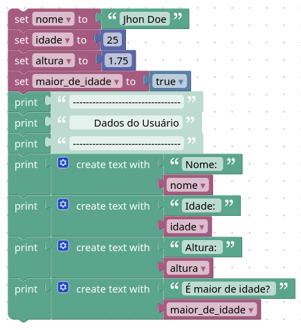

# Code Park 09

## Problema

Construa um algoritmo no Blockly que declare as seguintes variáveis: nome, idade, altura e maior_de_idade.

Depois, atribua valores para essas variáveis, sabendo que a variável nome é uma string, a variável idade é um inteiro, a variável altura é um float e a variável maior_de_idade é um booleano.

No final, imprima os valores das variáveis.

## Solução

**Representação em blocos**

Link para o blockly: https://blockly-demo.appspot.com/static/demos/code/index.html#gk7229



**Codigo em JavaScript**

```javascript
var nome, idade, altura, maior_de_idade;

nome = 'Jhon Doe';
idade = 25;
altura = 1.75;
maior_de_idade = true;
window.alert('---------------------------------');
window.alert('        Dados do Usuário');
window.alert('---------------------------------');
window.alert('Nome: ' + String(nome));
window.alert('Idade: ' + String(idade));
window.alert('Altura: ' + String(altura));
window.alert('É maior de idade? ' + String(maior_de_idade));
```