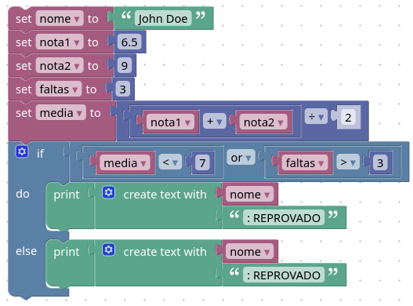

<<<<<<< HEAD
# Code Park 10
=======
# Code Park 09
>>>>>>> d452bcc96d8db962a72f61274235162641f3d23c

## Problema

Desenvolva, utilizando o Google Blockly, um programa que utiliza o nome de um aluno, duas notas e a quantidade de faltas que ele teve. Conclua se o aluno está aprovado ou reprovado de acordo com as especificações:
 
- Se a média do aluno for menor que sete, o sistema deve informar o nome do aluno e que ele está reprovado;
- Se o aluno possuir mais de três faltas, o sistema deve informar o nome do aluno e que ele está reprovado;
Se a média do aluno for maior ou igual a sete, o sistema deve informar o nome do aluno e que ele está aprovado.

No sistema, todos os valores devem estar armazenados em variáveis.

## Solução

**Representação em blocos**

Link para o blockly: https://blockly-demo.appspot.com/static/demos/code/index.html#xxgwyz



**Codigo em JavaScript**

```javascript
var nome, nota1, nota2, faltas, media;

nome = 'John Doe';
nota1 = 6.5;
nota2 = 9;
faltas = 3;
media = (nota1 + nota2) / 2;
if (media < 7 || faltas > 3) {
  window.alert(String(nome) + ': REPROVADO');
} else {
  window.alert(String(nome) + ': REPROVADO');
}
´´´
