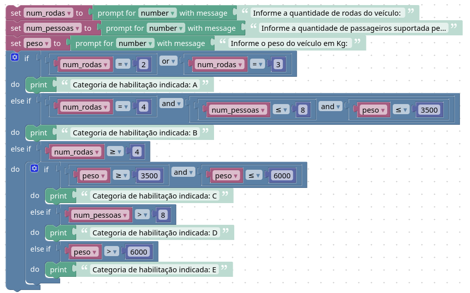

# Code Park 11

## Problema

Desenvolva um código, utilizando o Google Blockly, que utilize as seguintes características de um veículo:
- Quantidade de rodas;
- Peso bruto em quilogramas;
- Quantidade de pessoas no veículo.

Com essas informações, o programa mostrará qual é a melhor categoria de habilitação para o veículo informado a partir das condições:
A: Veículos com duas ou três rodas;
B: Veículos com quatro rodas, que acomodam até oito pessoas e seu peso é de até 3500 kg;
C: Veículos com quatro rodas ou mais e com peso entre 3500 e 6000 kg;
D: Veículos com quatro rodas ou mais e que acomodam mais de oito pessoas;
E: Veículos com quatro rodas ou mais e com mais de 6000 kg.

## Solução

**Representação em blocos**

Link para o blockly: https://blockly-demo.appspot.com/static/demos/code/index.html#ue5jyr



**Codigo em JavaScript**

```javascript
var num_rodas, num_pessoas, peso;

num_rodas = Number(window.prompt('Informe a quantidade de rodas do veículo: '));
num_pessoas = Number(window.prompt('Informe a quantidade de passageiros suportada pelo veículo: '));
peso = Number(window.prompt('Informe o peso do veículo em Kg: '));
if (num_rodas == 2 || num_rodas == 3) {
  window.alert('Categoria de habilitação indicada: A');
} else if (num_rodas == 4 && num_pessoas <= 8 && peso <= 3500) {
  window.alert('Categoria de habilitação indicada: B');
} else if (num_rodas >= 4) {
  if (peso >= 3500 && peso <= 6000) {
    window.alert('Categoria de habilitação indicada: C');
  } else if (num_pessoas > 8) {
    window.alert('Categoria de habilitação indicada: D');
  } else if (peso > 6000) {
    window.alert('Categoria de habilitação indicada: E');
  }
}
´´´
