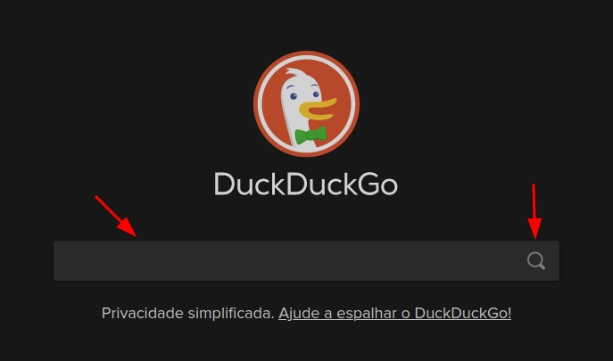
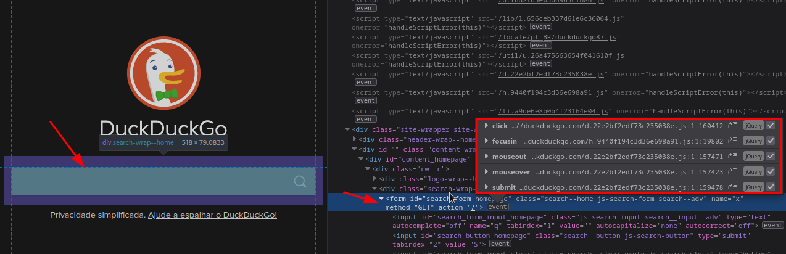
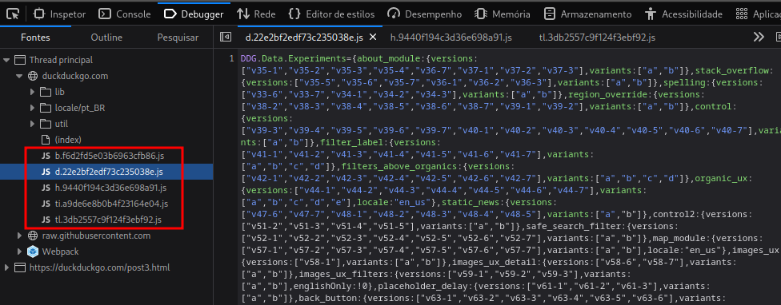
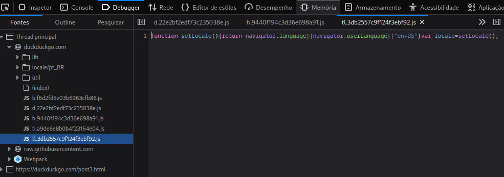
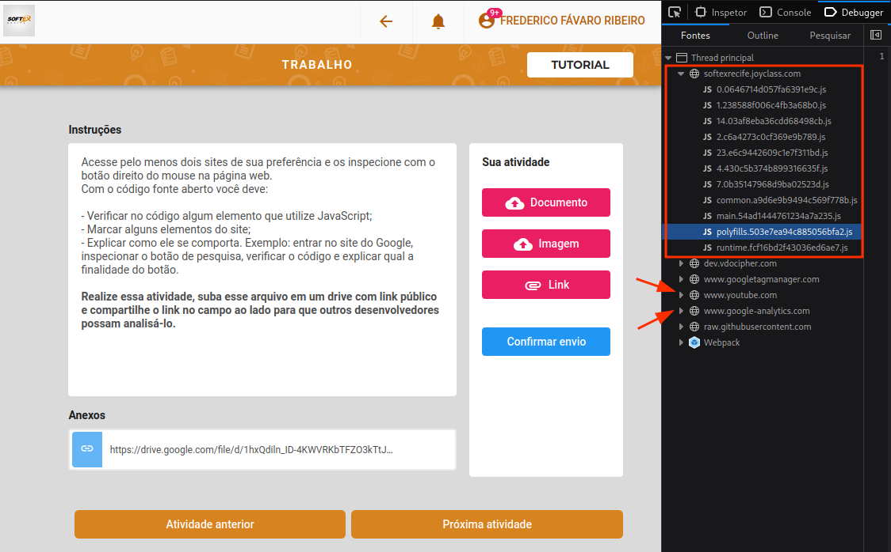
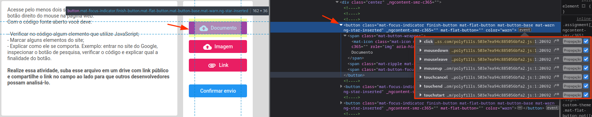
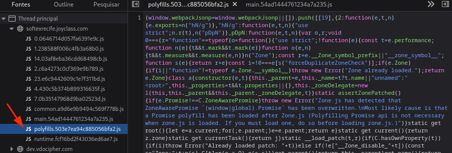

# Identificando javascript em sites

## Instruções

Acesse pelo menos dois sites de sua preferência e os inspecione com o botão direito do mouse na página web.
Com o código fonte aberto você deve:
- Verificar no código algum elemento que utilize JavaScript;
- Marcar alguns elementos do site;
- Explicar como ele se comporta. Exemplo: entrar no site do Google, inspecionar o botão de pesquisa, verificar o código e explicar qual a finalidade do botão.

## Atividade

### Caso 1 - Duck Duck Go

Na tela inicial do site de buscas duckduckgo.com, foi utilizado a função *inspecionar* do navegador Firefox no campo de busca do site.

Na janela de inspeção, foi possível observar algumas chamadas para funções em arquivos javascript. Na imagem a seguir, pode ser observada a chamada para algumas funções que utilizam a interação no campo de busca: Interação ao clicar, posicionar o cursor ou removê-lo de cima do campo.

Na aba debugger, é possível visualizar alguns dos arquivos javascript usados, na imagem a seguir está um dos arquivos relacionados com o campo de busca. Particularmente não consigo traduzir o que está no arquivo.

Contudo, no último arquivo identificado no debugger, temos uma função bem simples que serve para identificar algumas informações do navegador do usuário para identificar do usuário e abrir a versão do site ou do conteúdo no idioma adequado, caso o código não consiga obter a informação ou o idioma do usuário não tem suporte no site, ele define como padrão o inglês americano.

## Caso 2 - Pagina da atividade no joyclass da softex

Inspecionando a tela da atividade no joyclass no debugger, é possível identificar alguns arquivos javascript do site em si, bem como algumas APIs usadas no site como o google analytics e youtube.

Se voltarmos a atenção aos botões para enviar a atividade, vemos o arquivo js responsável por suas ações: **polyfills.503e7ea94c885056bfa2.js**.
Pode ser observado também, que as funções estão mais direcionadas para os efeitos de interação do usuário com o botão, ou seja, o que o botão faz ao ser clicado, deixar o mouse sobre ele e assim por diante.

Essa última imagem mostra o arquivo mencionado anteriormente.

